# Tic Tac Toe

## Features

- Game can be extended to NxN board
- Game can be played by 2 players:
    1. Human vs Dumb Computer
    2. Human vs Human
    3. Human vs Smart Computer
- Game can be played over the network.


## Components

### Player

```go
type Player interface {
    Play(*board.Board) int
    Move() Move
    Name() string
}
```

Player is an interface who can play.

- Concrete implementations include `Human`, `RandomComputer`
    1. `Human` - Takes input from STDIN
    2. `RandomComputer` - Generates a random input.
    3. `SmartComputer` - Generates input based on context of the game. It Makes decisions to win

For SmartComputer implementations, I had look at references for [minimax algorithms](https://www.youtube.com/watch?v=trKjYdBASyQ&t=772s&ab_channel=TheCodingTrain)

### Board

Board stores all the use inputs, validates if the input is valid.
Internally it stores a one dimensional array of `integer`.

```go
type Board struct {
    moves int          // moves represents the total number of valid moves made on board
    size  int          // size of NxN matrix, represents N
    grid  []int        // one dimensional array representing NxN matrix
}
```

### Game

Game has the context of board and players. It drives the whole tic-tac-toe game.
It validates when the game is completed and returns.

```go
type Game struct {
    board     *board.Board // tic tak toe board
    playerOne player.Player
    playerTwo player.Player
}
```

## Set up

### Requirements

- [Golang](https://golang.org/dl/)

Once `Go` is installed run the below command

```go
make build
./play
```

### Playing over the network

1. Start the server.

```shell
go run main.go server
```

2. Connect to the server.

```shell
nc 127.0.0.1 8080
```

It needs to players to connect, so run the `nc` command twice in different terminal session.

### Running the cli

```shell
go run main.go cli
```

## Demo

### Smart Computer




### Starting the server


### Connecting to the server


